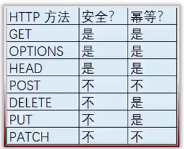
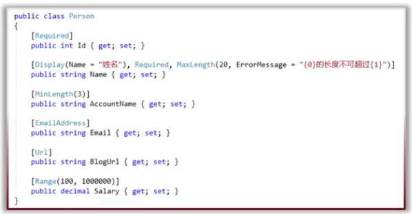
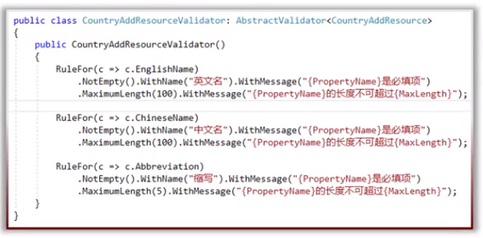
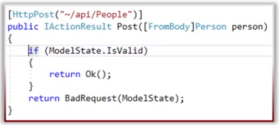
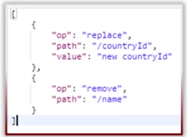

# 2019-04-22
## POST，PUT，PATCH，DELETE，Model验证
### 安全性和幂等性
  

- **安全性**是指方法执行后并不会改变资源的表述
- **幂等性**是指方法无论执行多少次都会得到同样的结果

### POST添加资源
不安全，不幂等
- 参数[FromBody]
- 成功返回201 Created
  - 可以使用CreatedAtRoute()返回201:允许响应里带着Location Header，在这个Location Header里包含着URI，通过这个URI就可以GET到我们刚刚创建好的资源
- 也需要添加HATEOAS的支持

### Model验证
- 定义验证的规则
- 检查验证的规则
- 把验证的错误信息发送给API消费者
  
- 可以使用aspNetCore内置的验证,不推荐，因为业务类与验证逻辑混在一起：
  - DataAnnotation
  - ValidationAttribute
  - IValidatebleObject
- (本例使用)第三方：FluentValidation

### 为什么使用FluentValidation
- 关注点分离（Soc,Seperation of Concerns)
- 安装
  - FluentValidation
  - FluentValidation.AspNetCore
- 为每一个Resource建立验证器

  - 继承`AbstractValidator<T>`
- startup配置：
  - `services.AddMvc(……).AddFluentValidation();`
  - `services.AddTransient<IValidator<ResourceModel>,ResourcModelValidator>();`
### 如何验证
  

- 使用ModelState.IsValid
- ModelState
  - 它是一个字典，包含了Model的状态以及Model所绑定的验证
  - 对于提交的每个属性，他都包含了一个错误信息的集合
- 返回：422 Unprocessable Entity
  - 验证错误信息在响应的body里面带回去

### POST 一次性添加集合资源
- 把整个集合看作一种资源
- 参数为 `[FromBody] IEnumerable<T>`
- 成功后返回201，CreatedAtRoute(),带着多个ID的集合。
- GET方法参数为ID的集合，用于查询创建的集合资源。
  - ArrayModelBinder:IModelBinder

### 自定义验证错误返回结果
- 满足 Angular客户端表单验证要求：
  - 错误的类型：required,maxLength.....
- 创建MyUnprocessableEntityObjectResult
  - 继承：ObjectResult
  - `ResourceValidationResult：Dictionary<sting,IEnumerable<ResourceValidationError>>`

### HTTP DELETE
- 参数id
- 返回：
  - 204 No Content
- 不安全的
- 幂等的
  - 多次请求的副作用和单次请求的副作用是一样的，每次发送了DELETE请求之后，服务器的状态是一样的。

### HTTP PUT整体更新
整体更新
- 参数：ID，`[FromBody](不包含ID的其他需要更新的属性集合)`
  -使用一个单独的Resource Model
- 返回：
  - 204 No Content
  - 200 OK
- 不安全的
- 幂等的
#### 关于PUT整体更新
- 整体更新容易引起一些问题
  - **当传入的需要更新的属性集合，其中没有包含某个属性，如果在数据库中该属性有值，在put更新后，该没有包含在更新属性集合的属性将被变为null或者默认值**
  - **使用整体更新put时需要谨慎**
- 集合资源的整体更新(基本不用)

### HTTP PATCH局部更新
- RFC 6902（Json Patch)
- 媒体类型为 application/json-patch+json
 
- op,操作的类型  
  - 添加：`{"op":"add","patch":"/属性名","value":"属性值"}`,如果该属性不存在值，则添加该值到该属性，如果属性存在值，则改变属性值。这个对静态类不适用。
  - 删除：`{"op":"remove","patch":"/属性名"}`,删除某个属性值，或者把这个属性设置为默认值
  - 替换：`{"op":"replace","patch":"/属性名","value":"属性值"}`，改变属性值，可以理解为先执行删除，之后进行添加。
  - 复制：`{"op":"copy","from":"/属性名1"，"patch":"/属性名2"}`，把**属性名1**的值赋给**属性名2**。
  - 移动：`{"op":"move","from":"/属性名1"，"patch":"/属性名2"}`，把**属性名1**的值赋给**属性名2**，并把**属性名1**的值删除或设置为默认值。
  - 测试：`{"op":"test","patch":"/属性名","value":"指定值"}`，测试目标属性的值和指定值是否一致。
- path，资源的属性名
  - 可以包含层级结构
- value,更新的值
#### PATCH相关
- 参数: ID，`[FromBody] JsonPatchDocument<T>`
- patchDoc.ApplyTo()
- 返回
  - 204 No Content
  - 200 OK
- 不安全的
- 不幂等

## HTTP常用方法总结
- GET(获取资源)：
  - GET `api/countries`，返回200，集合数据；找不到返回404
  - GET `api/countries/{id}`，返回200，单个数据；找不到返回404
- DELETE(删除资源)：
  - DELETE `api/countries/{id}`,返回204，删除单个资源；找不到返回404
  - DELEET `api/countries`，很少用，返回204，删除集合资源；找不到返回404
- POST(创建资源)：
  - POST `api/countries`,成功返回201和单个资源，创建单个资源；如果资源没有创建成功返回404
  - POST `api/countries/{id}`,肯定不会成功，返回404或者409
  - POST `api/countryCollections`，成功返回201和集合资源，创建集合资源；没成功返回404
- PUT(整体更新)
  - PUT `api/countries/{id}`，成功返回200或204；没找到要更新的资源返回404
  - PUT `api/countries`,整体更新集合，很少见，成功返回200或204，失败返回404
- PATCH(局部更新)
  - PATCH `api/countries/{id}`,成功返回200或204，没成功返回404
  - PATCH `api/countries`,集合局部更新很少见，成功返回200或204，没成功返回404

## 创建过程
1. 在Infrastructure项目下Resource目录创建PostAddOrUpdateResource父类，用于创建和修改POST时使用
2. 在Infrastructure项目下Resource目录创建PostAddOrUpdateResourceValidator类，用于验证数据合法性
3. 在Infrastructure项目下Resource目录创建PostAddResource类，继承自PostAddOrUpdateResource，用于创建POST使用