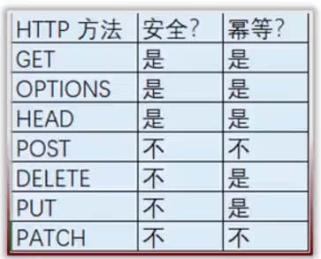
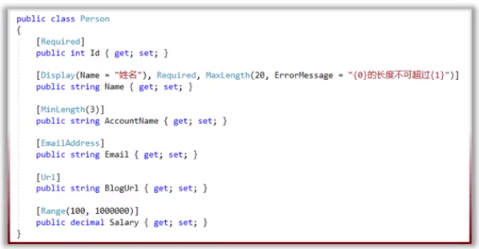

# 2019-04-22
## POST，PUT，PATCH，DELETE，Model验证
### 安全性和幂等性
  

- **安全性**是指方法执行后并不会改变资源的表述
- **幂等性**是指方法无论执行多少次都会得到同样的结果

### POST添加资源
不安全，不幂等
- 参数[FromBody]
- 成功返回201 Created
  - 可以使用CreatedAtRoute()返回201:允许响应里带着Location Header，在这个Location Header里包含着URI，通过这个URI就可以GET到我们刚刚创建好的资源
- 也需要添加HATEOAS的支持

### Model验证
- 定义验证的规则
- 检查验证的规则
- 把验证的错误信息发送给API消费者
  
- 可以使用aspNetCore内置的验证,不推荐，因为业务类与验证逻辑混在一起：
  - DataAnnotation
  - ValidationAttribute
  - IValidatebleObject
- (本例使用)第三方：FluentValidation

### 为什么使用FluentValidation
- 关注点分离（Soc,Seperation of Concerns)
- 安装
  - FluentValidation
  - FluentValidation.AspNetCore
- 为每一个Resource建立验证器

  - 继承`AbstractValidator<T>`
- startup配置：
  - `services.AddMvc(……).AddFluentValidation();`
  - `services.AddTransient<IValidator<ResourceModel>,ResourcModelValidator>();`
### 如何验证
  

- 使用ModelState.IsValid
- ModelState
  - 它是一个字典，包含了Model的状态以及Model所绑定的验证
  - 对于提交的每个属性，他都包含了一个错误信息的集合
- 返回：422 Unprocessable Entity
  - 验证错误信息在响应的body里面带回去

### POST 一次性添加集合资源
- 把整个集合看作一种资源
- 参数为 `[FromBody] IEnumerable<T>`
- 成功后返回201，CreatedAtRoute(),带着多个ID的集合。
- GET方法参数为ID的集合，用于查询创建的集合资源。
  - ArrayModelBinder:IModelBinder

### 自定义验证错误返回结果
- 满足 Angular客户端表单验证要求：
  - 错误的类型：required,maxLength.....
- 创建MyUnprocessableEntityObjectResult
  - 继承：ObjectResult
  - `ResourceValidationResult：Dictionary<sting,IEnumerable<ResourceValidationError>>`

### HTTP DELETE
- 参数id
- 返回：
  - 204 No Content
- 不安全的
- 幂等的
  - 多次请求的副作用和单次请求的副作用是一样的，每次发送了DELETE请求之后，服务器的状态是一样的。

## 创建过程
1. 在Infrastructure项目下Resource目录创建PostAddOrUpdateResource父类，用于创建和修改POST时使用
2. 在Infrastructure项目下Resource目录创建PostAddOrUpdateResourceValidator类，用于验证数据合法性
3. 在Infrastructure项目下Resource目录创建PostAddResource类，继承自PostAddOrUpdateResource，用于创建POST使用